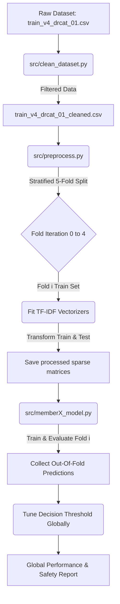

# AI Essay Detector - 5-Fold Cross-Validation Pipeline

This project implements a robust machine learning pipeline to detect AI-generated vs. human-written essays, specifically optimized to prevent false accusations against students (minimizing the False Positive Rate).

---

## 📖 Project Workflow & System Architecture

This project performs a comparative analysis of four machine learning models (**Logistic Regression, Support Vector Machine (SVM), Multinomial Naive Bayes, and Random Forest**) on the **DAIGT V4** dataset containing approximately 73,503 essays.

The system workflow is designed as a modular pipeline to guarantee data cleanliness and prevent data leakage:



### System Workflow Details:
1. **Data Cleaning (`src/clean_dataset.py`)**: Loads the raw essays, normalizes whitespaces, and removes corrupted or short entries (fewer than 100 words, which are typically prompt titles rather than complete essays).
2. **Stratified 5-Fold Splitting (`src/preprocess.py`)**: Splitting is done using a Stratified K-Fold with 5 splits (which naturally splits the data into 80% train and 20% test per iteration). This preserves the label distribution (62.5% AI and 37.5% human text) across all folds.
3. **Out-of-Fold Preprocessing (`src/preprocess.py`)**: TF-IDF vectorizers are fit **exclusively** on the training fold of each iteration and used to transform both the train and test subsets of that fold. This ensures **zero data leakage** during model training.
4. **Independent Training and Global OOF Evaluation (`src/memberX.py`)**: Each group member trains their model on the 5 folds. The predicted probabilities are accumulated across all folds to reconstruct out-of-fold predictions for the entire dataset, which are then used to tune the model's decision threshold for high specificity.

---

## 🛠️ Mandatory Preprocessing Techniques (3 Steps)

Our preprocessing pipeline executes the three mandatory steps required for text mining:

1. **Tokenization and Case Normalization**
   * **How it works**: The raw essay strings are parsed into individual word tokens. Characters are converted to lowercase.
   * **Implementation**: Managed internally by scikit-learn's `TfidfVectorizer` (which sets `lowercase=True` by default and utilizes word boundary regex patterns for tokenization).
   
2. **Stop-Word Elimination & Noise Reduction**
   * **How it works**: Frequently used structural words (such as "the", "is", "at", "which", "on") are removed using a standardized stop list. These words do not contain semantic information about classification.
   * **Implementation**: Handled by setting `stop_words='english'` in the Word-level TF-IDF vectorizer in `src/preprocess.py`.
   
3. **TF-IDF Vectorization (Term Frequency-Inverse Document Frequency)**
   * **How it works**: Evaluates word occurrences based on term frequency (how often a term appears in an essay) scaled by inverse document frequency (how common the term is across the entire corpus). This transforms raw text tokens into numerical vectors representing word rarity and importance.
   * **Implementation**: We build a hybrid feature matrix by horizontally stacking:
     * **Word-level TF-IDF** (1-to-2 n-grams, max 25,000 features, English stop words removed) to capture vocabulary structure.
     * **Character-level TF-IDF** (3-to-5 n-grams, max 25,000 features) to capture sub-word patterns, spelling errors, punctuation, and structural styles.

---

## 🚀 Execution Order (Process Flow)

To run the entire pipeline from scratch, execute the scripts in the following order:

### Step 1: Clean the Dataset
```bash
python src/clean_dataset.py
```
* **Purpose**: Removes corrupted/truncated text (essays with word count < 100) and normalizes whitespaces.
* **Input**: `train_v4_drcat_01.csv` (raw dataset)
* **Output**: `train_v4_drcat_01_cleaned.csv`

### Step 2: Preprocess and Split Folds
```bash
python src/preprocess.py
```
* **Purpose**: Performs a 5-Fold Stratified Split and extracts TF-IDF features (Word-level and Character-level) independently for each fold to avoid data leakage.
* **Input**: `train_v4_drcat_01_cleaned.csv`
* **Outputs**:
  * Sparse matrices: `processed_data/fold_{0-4}/X_train.npz`, `X_test.npz`
  * Label arrays: `processed_data/fold_{0-4}/y_train.npy`, `y_test.npy`
  * Fitted vectorizers: `models/fold_{0-4}/word_vectorizer.joblib`, `char_vectorizer.joblib`

### Step 3: Run Model Training & Evaluation
```bash
python src/member1_logistic.py
```
* **Purpose**: Loops through all 5 folds, trains a Logistic Regression model (with hyperparameter tuning via nested GridSearchCV), tracks out-of-fold (OOF) predictions, and tunes the decision threshold globally to ensure a False Positive Rate (FPR) <= 0.1%.
* **Input**: Preprocessed fold matrices in `processed_data/`
* **Output**: Trained models saved to `models/fold_{0-4}/logistic_regression_model.joblib`

---

## 👥 Template for Other Group Members

If you are another team member building a new model (e.g., Random Forest, SVM, LightGBM), you can write your own training script in `src/member2_yourmodel.py`. 

Here is a ready-to-use template that integrates with the preprocessed 5-fold data and the shared evaluation script:

```python
import os
import numpy as np
import joblib
from scipy.sparse import load_npz
from evaluate import calculate_metrics, print_evaluation_report, tune_decision_threshold

# TODO: Import your chosen model/classifier
# from sklearn.ensemble import RandomForestClassifier

def train_model(data_dir, models_dir):
    print("=== Member 2: Loading Shared Preprocessed Folds ===")
    
    n_folds = 5
    oof_probs = []
    oof_labels = []
    fold_metrics_list = []
    
    for fold in range(n_folds):
        print(f"\n--- Training Fold {fold} ---")
        fold_data_dir = os.path.join(data_dir, f"fold_{fold}")
        fold_models_dir = os.path.join(models_dir, f"fold_{fold}")
        
        # 1. Load preprocessed sparse matrices
        X_train = load_npz(os.path.join(fold_data_dir, "X_train.npz"))
        X_test = load_npz(os.path.join(fold_data_dir, "X_test.npz"))
        y_train = np.load(os.path.join(fold_data_dir, "y_train.npy"))
        y_test = np.load(os.path.join(fold_data_dir, "y_test.npy"))
        
        # 2. Instantiate and fit your model
        # model = RandomForestClassifier(random_state=42, n_jobs=-1)
        # model.fit(X_train, y_train)
        
        # 3. Predict probabilities on test fold
        # y_prob = model.predict_proba(X_test)[:, 1]
        # y_pred_default = (y_prob >= 0.5).astype(int)
        
        # 4. Save test fold predictions for global evaluation
        # oof_probs.append(y_prob)
        # oof_labels.append(y_test)
        
        # 5. Evaluate this fold individually (optional)
        # fold_metrics = calculate_metrics(y_test, y_pred_default, y_prob)
        # fold_metrics_list.append(fold_metrics)
        
        # 6. Save your trained model
        # os.makedirs(fold_models_dir, exist_ok=True)
        # model_save_path = os.path.join(fold_models_dir, "member2_model.joblib")
        # joblib.dump(model, model_save_path)
        
    # 7. Concatenate all folds to calculate Global Out-of-Fold Metrics
    # oof_y_prob = np.concatenate(oof_probs)
    # oof_y_true = np.concatenate(oof_labels)
    
    # print("\n=== Global Out-of-Fold Evaluation (Default Threshold = 0.5) ===")
    # oof_default_metrics = calculate_metrics(oof_y_true, (oof_y_prob >= 0.5).astype(int), oof_y_prob)
    # print_evaluation_report("Your Model Name (Global OOF - Default)", oof_default_metrics)
    
    # print("\n=== Academic Integrity Tuning (FPR <= 0.1%) ===")
    # best_threshold, tuned_metrics = tune_decision_threshold(oof_y_true, oof_y_prob, target_fpr=0.001)
    # print_evaluation_report(f"Your Model Name (Global OOF - Tuned @ {best_threshold:.3f})", tuned_metrics)

if __name__ == "__main__":
    DATA_DIR = "processed_data"
    MODELS_DIR = "models"
    train_model(DATA_DIR, MODELS_DIR)
```
